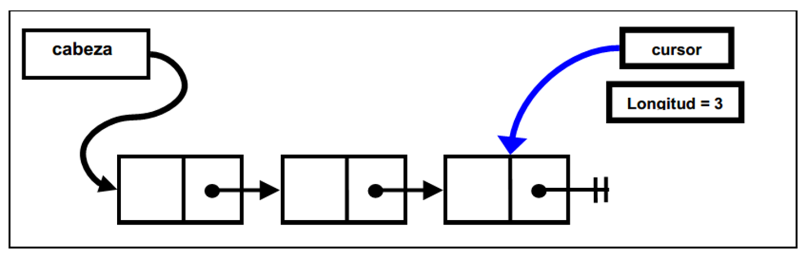
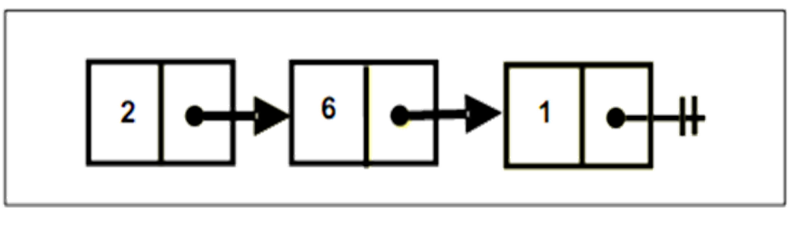
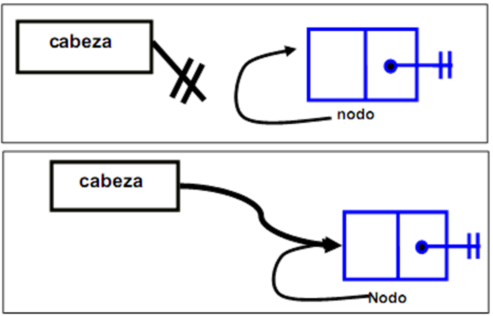
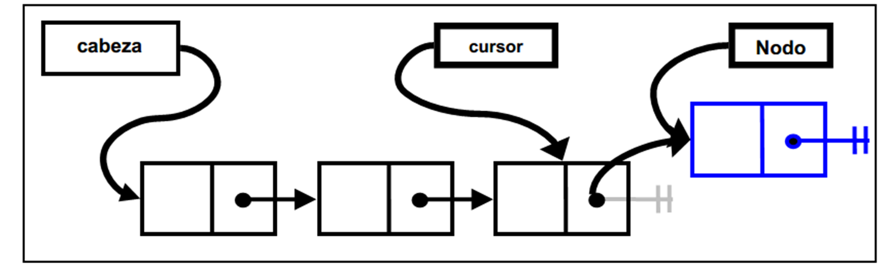
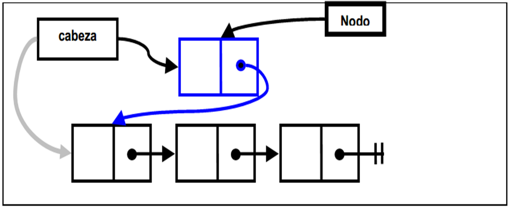
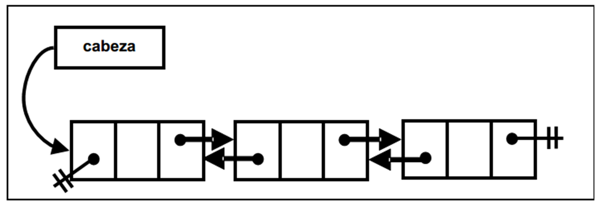
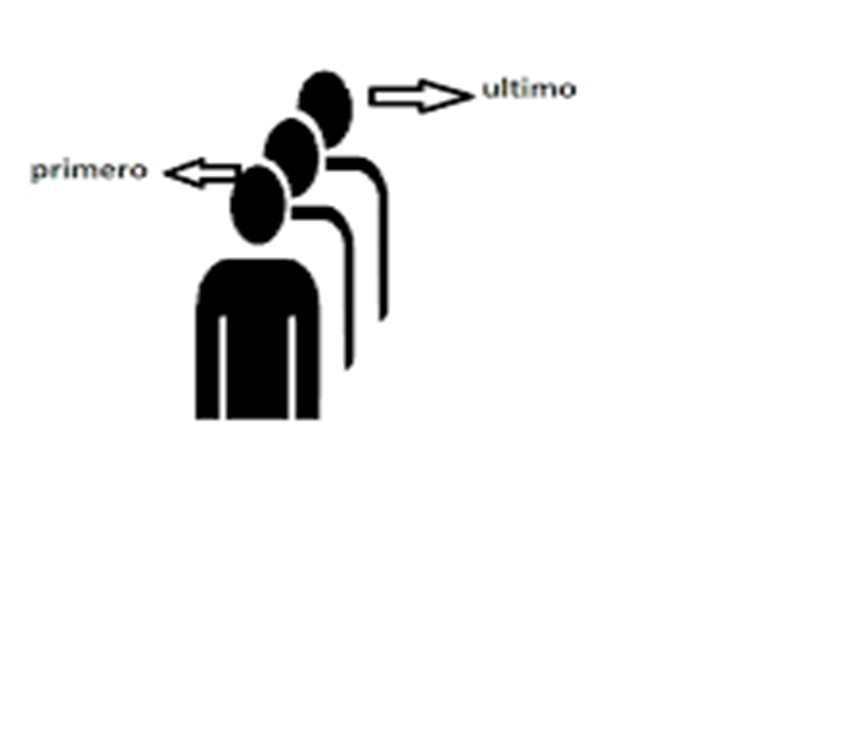

# Lista Ligada

  ## Lista Simplesmente Ligada

  # A lista com ponteiro: 
  é uma sequência de nós (células) ligados
  
  
  
  ### Nó: 
  ###### .É o elemento básico da estrutura de dados. 

  ###### .Cada nó consistindo em um elemento da lista e um ponteiro para o próximo nó da lista.

  ## Métodos desenvolvidos neste repositório
  #### vazia ✔
  #### extensao ✔ 
  #### adicionar ✔ 
  #### adicionar✔ 
  
  
  #### obter✔
  #### extrair✔
  #### procurar✔

  
  
   
  
  ## Vantagens

  Vetores (listas implementadas com array) são uma excelente alternativa ao uso direto de arrays em Java,
  porém para algumas tarefas eles podem não ser ecientes, justamente por esse fato.
  Adicionar um elemento na primeira posição de um Vetor, por exemplo, consome muito tempo, pois temos
  de deslocar todos os outros elementos uma posição para a frente. A performance dessa operação degrada
  a medida que a quantidade de elementos do nosso vetor cresce: ela consome tempo linear em relação ao
  número de elementos.
    Analogamente, remover um elemento da primeira posição implica em deslocar todos os outros elementos
  que estão na sua frente para trás.
    Em alguns casos, queremos uma implementação de Lista na qual a operação de adicionar ou a de remover
  um aluno na primeira posição seja computacionalmente efciente

  ## Lista Duplamente Ligada
  Uma lista duplamente ligada é uma lista ligada na qual a cada nó contém dentro de si a referência ao elemento seguinte e ao elemento anterior.
  
  

  Para o método que remove o elemento do m da Lista ter consumo de tempo constante, a última célula
  deve se referir a penúltima. Isso é possível se utilizarmos o esquema de Lista Duplamente Ligada, no qual as
  células possuem referências tanto para a próxima e quanto para a célula anterior.

  ## Conclusão
  As listas com ponteiros fazem um uso mais eficiente da memória que as listas implementadas sobre arrays.

  A diferença entre uma lista simplesmente ligada e uma duplamente ligada é que a primeira usa nós simplesmente ligados (informação + referência ao seguinte)  e a segunda usa nós duplamente ligados (informação + eferência ao seguinte +   referência ao anterior)
# Pilhas com Ponteiros(Lista Ligada)
  Implementar o TDA Pilha e o TDA Fila fazendo uso de ponteiros

## Pilha: 
  Colecção onde os elementos se adicionan e extraem por um mesmo extremo, chamado topo.
  Conjunto de elementos que cumprem com a seguinte característica:
  O último elemento colocado na pilha, é o primeiro
  a saír desta.
                  (LIFO= Last In First Out).

### TDA Pilha. Operações básicas
  top: Retorna o elemento no topo da pilha.
  pop: Exclui o elemento no topo da pilha. 
  push: adiciona um elemento no topo da pilha. O antigo elemento no topo torna-se próximo ao topo e assim por diante.
  empty: Retorna verdadeiro se a pilha for vazia; falso caso contrário.

## Filas:

### Fila: 
  colecção de elementos onde estes são adicionados no final (fundo)  e extraído pelo início (frente).
  
  Conjunto de elementos que cumprem com a seguinte característica:
  O primeiro elemento colocado na fila, é o primeiro
  em sair desta. 
                  (FIFO= Fist In First Out).
  
### Fila Fila:
  

### Fila do Banco:
  

### Fila do Mercado ou da Loja:
  
